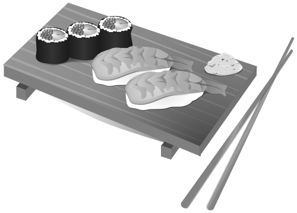

+++
title = "Computing image filters with wgpu-rs"
date = "2022-02-11"

[taxonomies]
categories = ["rust", "wgpu", "tutorial"]
+++

This post should give you a few tips about creating a simple image processing pipeline with compute shaders, using `wgpu-rs` and `rust` .

<!-- more -->

# Getting started

You probably already know this but your GPU (aka your Graphic Processing Unit - your graphic card if you have one) does not only render graphics, but is also capable of computing regular algorithms. Yup, you can use your GPU to calculate a fibonacci sequence if that is your fancy.

One of the things that your GPU excel at is parallel computation, as they are optimized to render multiples pixels at once.

Accessing the power of the graphic cards for computing used to be fairly complex: 
* Nvidia (as always) has their own proprietary library CUDA.
* OpenCl is an open source and free parallel programming api made by the Khronos group (also responsible for OpenGl and Vulkan, all the cool stuff).
* Android implemented their own compute api, RenderScript.

Nowadays, each rendering api has their own solution as well. You can do GPU computation using
* Metal on Apple.
* DirectX 11+ on Windows.
* Vulkan everywhere.

In the `rust` ecosystem, `wgpu-rs` is a great library that will abstract these different backends, and allow you to write portable GPU computation code that will run everywhere (hopefully, I'm currently only trying the code on a Windows machine without a mean to really test portability).

> **Who is the target of this article?**
>  
> Beginners in GPU programming like me with some notion of `rust` , who like the idea of using their GPU for something else than graphics, but are mostly tinkering and wondering what they are doing at every step of the way.

# Writing a simple grayscale filter

The plan is simple:
* Take a sample image.
* Load it to the graphic card as a texture.
* Apply a compute shader to calculate a grayscale version of it.
* Retrieve the resulting image and save it to disk.

## A few dependencies…

Let's start with creating a new project.

```bash
cargo new image-filters
```

As always, this will create a new rust project, including a `Cargo.toml` file and a hello world `main.rs` file.
Let's edit the `Cargo.toml` file and add all the dependencies we will need.

```toml
[package]
name = "image-filters"
version = "0.1.0"
edition = "2021"

[dependencies]
anyhow = "1.0"
bytemuck = "1.7"
image = "0.24"
pollster = "0.2"
wgpu = "0.12"
```

So, what are those?
* `wgpu` is obvious.
* `image` will allow us to load a png file, decode it, and read it as a stream of bytes.
* `bytemuck` is a utility crate used for casting between plain data types.
* `anyhow` is here so we can rethrow most results as this is just sample code.
* `pollster` is used here as several function in `wgpu` are async. `pollster` allows us to block our code until the `async` method finish.

## Wgpu basics

Let's get started in the `main` method.

```rust
fn main() -> anyhow::Result<()> {
```

We return an `anyhow::Result` to simplify error handling.

We then create the device and the queue.
* The device represent an open connection to your GPU, and we will use it later to create the resources we need (like textures).
* We will use the queue to issue commands to the GPU.

```rust
let instance = wgpu::Instance::new(wgpu::Backends::all());
let adapter = pollster::block_on(instance.request_adapter(&wgpu::RequestAdapterOptionsBase {
    power_preference: wgpu::PowerPreference::HighPerformance,
    force_fallback_adapter: false,
    compatible_surface: None,
}))
.ok_or(anyhow::anyhow!("Couldn't create the adapter"))?;
let (device, queue) = pollster::block_on(adapter.request_device(&Default::default(), None))?;
```

This is fairly standard:
* you create your instance, requesting any backend. You could instead specify the one of your choice, like `wgpu::Backends::VULKAN`.
* when creating your adapter, you can specify your power preferences. Here, I ask for `HighPerformance`, but you could also choose `LowPerformance`.
* you then create your device and queue, and they will come handy later for every operations.

We use pollster here to block on the `request_device` method, as it is an `async` call.

```rust
fn main() -> anyhow::Result<()> { ... }
```

## Loading the texture

Here we shall work with a png file and include it as bytes in the source code, for simplicity.

```rust
let input_image = image::load_from_memory(include_bytes!("sushi.png"))?.to_rgba8();
let (width, height) = input_image.dimensions();
```

Using the image crate, we load the sushi image, and make sure it is using the `rbga` format.


Using the device, we then create a wgpu texture.

```rust
let texture_size = wgpu::Extent3d {
    width,
    height,
    depth_or_array_layers: 1,
};

let input_texture = device.create_texture(&wgpu::TextureDescriptor {
    label: Some("input texture"),
    size: texture_size,
    mip_level_count: 1,
    sample_count: 1,
    dimension: wgpu::TextureDimension::D2,
    format: wgpu::TextureFormat::Rgba8Unorm,
    usage: wgpu::TextureUsages::TEXTURE_BINDING | wgpu::TextureUsages::COPY_DST,
});
```

* No mipmapping or multi sampling are used here, so we keep `mip_level_count` and `sample_count` to 1.
* It's usage specifies:
  + `TEXTURE_BINDING`: the texture can be bound to a shader for sampling, meaning we will be able to retrieve its pixels in our compute code.
  + `COPY_DST`: we can copy data into it. And we need to copy data into it, as the texture is currently empty.
* The format is another interesting beast: several formats are supported by `wgpu`. Using `Rgba8Unorm` means that the texture contains 8 bit per channel (aka a byte), in the r, g, b, a order, but that the u8 values from [0 - 255] of each channel will be converted to a float between [0 - 1].

```rust
queue.write_texture(
    input_texture.as_image_copy(),
    bytemuck::cast_slice(input_image.as_raw()),
    wgpu::ImageDataLayout {
        offset: 0,
        bytes_per_row: std::num::NonZeroU32::new(4 * width),
        rows_per_image: None, // Doesn't need to be specified as we are writing a single image.
    },
    texture_size,
);
```

We copy the image data to the texture, which we can do as we declared the texture usage `COPY_DST` .

Every pixel is made of 4 bytes, one per color channel, meaning that `bytes_per_row` is 4 times the width of the image.

## Creating an output texture

We will use an output texture to store the grayscale version of our image.

```rust
let output_texture = device.create_texture(&wgpu::TextureDescriptor {
    label: Some("output texture"),
    size: texture_size,
    mip_level_count: 1,
    sample_count: 1,
    dimension: wgpu::TextureDimension::D2,
    format: wgpu::TextureFormat::Rgba8Unorm,
    usage: wgpu::TextureUsages::COPY_SRC | wgpu::TextureUsages::STORAGE_BINDING,
});
```

It's usage is slightly different:
* `COPY_SRC` instead of `COPY_DST`, as we will copy from it later to retrieve our filtered image.
* `STORAGE_BINDING` instead of `TEXTURE_BINDING` to indicate that it will be bound in a shader as a place to store the computation result.

## Shader time

### Shader what?

A compute shader is a set of instructions that will be given to your GPU to tell it what calculations are needed.

In the same way that a CPU program can be written in multiple languages (rust, C, C++, ...), a GPU program can be written in multiple languages also (GLSL, HLSL, SIR-V, MSL) that need to be compiled as well.

It could be a mess, but `wgpu` uses a universal shader translator, [ `naga` ](https://github.com/gfx-rs/naga) , that allow you to write your shader in `wgsl` or `glsl` , and make sure they are properly converted for each backend.

If you run your program on an Apple computer using the `metal` backend, your shader will be translated to the metal shading language (or `msl` ) automagically.

With all that being said, let's take a look at our `wgsl` instructions to convert an image from color to grayscale.

```wgsl
[[group(0), binding(0)]] var input_texture : texture_2d<f32>;
[[group(0), binding(1)]] var output_texture : texture_storage_2d<rgba8unorm, write>;

[[stage(compute), workgroup_size(16, 16)]]
fn grayscale_main(
  [[builtin(global_invocation_id)]] global_id : vec3<u32>,
) {
    let dimensions = textureDimensions(input_texture);
    let coords = vec2<i32>(global_id.xy);

    if(coords.x >= dimensions.x || coords.y >= dimensions.y) {
        return;
    }

    let color = textureLoad(input_texture, coords.xy, 0);
    let gray = dot(vec3<f32>(0.299, 0.587, 0.114), color.rgb);

    textureStore(output_texture, coords.xy, vec4<f32>(gray, gray, gray, color.a));
}
```

Contrarily to the CPU approach, where we would write one piece of code that iterates on every pixel to calculate it's grayscale value, the compute shader will be a piece of code that runs concurrently on each pixel.

We declare two variable, input and output texture, that match the textures we created in `rust` . The output is of the type `texture_storage_2d` , with the same `rgba8unorm` type as before.

Our `grayscale_main` function declares a **workgroup size**, but more on that later.

The rest is straightforward:
* Get the coordinates of the current pixel.
* Get the dimensions of the input image.
* If we are out of bounds, return.
* Load the pixel.
* Calculate the gray value of said pixel.
* Write it to the output texture.

> Having chosen the `Rbga8Unorm` format for our textures, the colors are retrieved as a float between 0 and 1, and we don't need to cast them when multiplying the r, g and b values to figure out the grayscale value.
>  
> If we had chosen instead the `Rbga8Uint` format instead, textureLoad would instead return a color of type `vec<u8>` , keeping the values between 0 and 255, and we would first need to cast them to float, before multipling them and recasting them to unsigned byte before writing down the output.

### Loading the shader and creating the pipeline

Okay, back to rust!

```rust
let shader = device.create_shader_module(&wgpu::ShaderModuleDescriptor {
    label: Some("Grayscale shader"),
    source: wgpu::ShaderSource::Wgsl(include_str!("shaders/grayscale.wgsl").into()),
});

let pipeline = device.create_compute_pipeline(&wgpu::ComputePipelineDescriptor {
    label: Some("Grayscale pipeline"),
    layout: None,
    module: &shader,
    entry_point: "grayscale_main",
});
```

Our shader is loaded as text. We specify our entry point, matching the `grayscale_main` function in the shader.

## Bind group

We then proceed to creating our bind group: it is the rust representation of the data that will be attached to the gpu:

In the shader, we annotated our input_texture with `[[group(0), binding(0)]]` . We must now tell our `rust` code what it corresponds too.

```rust
let texture_bind_group = device.create_bind_group(&wgpu::BindGroupDescriptor {
        label: Some("Texture bind group"),
        layout: &pipeline.get_bind_group_layout(0),
        entries: &[
            wgpu::BindGroupEntry {
                binding: 0,
                resource: wgpu::BindingResource::TextureView(
                    &input_texture.create_view(&wgpu::TextureViewDescriptor::default()),
                ),
            },
            wgpu::BindGroupEntry {
                binding: 1,
                resource: wgpu::BindingResource::TextureView(
                    &output_texture.create_view(&wgpu::TextureViewDescriptor::default()),
                ),
            },
        ],
    });
```

For the group 0, we match our `input_texture` to the binding 0, and our `output_texture` to the binding 1, just like in the shader!

> In this example, we bind two textures, but we could also bind data buffers or a texture sampler if we wanted.

> `pipeline.get_bind_group_layout(0)` automatically creates a bind group layout for us, based on the shader. Alternatively, we could create the bind group layout by hand instead, to be even more specific. It is out of scope here, so let's ignore that for this article.

## Workgroup and dispatch

### Workgroup ?

Didn't I tell you that we would speak about workgroup?

A workgroup is a set of invocations which concurrently execute a compute shader stage entry point (here, our main function), and share access to shader variables in the workgroup address space.

In our shader, we specified a workgroup of dimension 16 by 16. It can be seen as 2D matrix of instructions executed at once. In our case, 16 by 16 equals 256. Our shader will process when running 256 pixels at once! Take that, sequential computing!

Of course, our image is a bit bigger than 16x16, so we need to call this compute shader multiple times to handle every single pixels.

How many times exactly? Well, we simply divide the width and height of our image by the workgroup dimensions, and it will tell us how many times we need to run this 16x16 matrix to cover everything.

Let's have a simple helper method for that:

```rust
fn compute_work_group_count(
    (width, height): (u32, u32),
    (workgroup_width, workgroup_height): (u32, u32),
) -> (u32, u32) {
    let x = (width + workgroup_width - 1) / workgroup_width;
    let y = (height + workgroup_height - 1) / workgroup_height;

    (x, y)
}
```

This method makes sure that there will be enough workgroup to cover each pixels. 

> If we had a width of 20 pixels and height 16, using the workgroup of dimension 16 by 16, we would be missing a band of 4 pixels by only creating a single workgroup. We would need to create a second workgroup to handle the extra pixels, and we would then be able to cover 32 pixels in width.
>
> Some work will go to waste, but it's better than not applying our filters to a band of pixels.

### Dispatching

We will need a command encoder to chain our different operations:

```rust
let mut encoder =
    device.create_command_encoder(&wgpu::CommandEncoderDescriptor { label: None });
```

And now we create our compute pass, set our pipeline, bind our textures, and dispatch our work to the GPU!

```rust
{
    let (dispatch_with, dispatch_height) =
        compute_work_group_count((texture_size.width, texture_size.height), (16, 16));
    let mut compute_pass = encoder.begin_compute_pass(&wgpu::ComputePassDescriptor {
        label: Some("Grayscale pass"),
    });
    compute_pass.set_pipeline(&pipeline);
    compute_pass.set_bind_group(0, &texture_bind_group, &[]);
    compute_pass.dispatch(dispatch_with, dispatch_height, 1);
}
```

Dispatching tells `wgpu` how many invocation of the shader, or how many workgroups, must be created in each dimension. 

> For a picture of 48x32 pixels, we would need to dispatch 6 workgroups: 3 in the `x` dimensions times 2 in the `y` dimensions.

> `dispatch` takes a third argument, set here to 1: workgroup can also be defined in three dimensions! But we are working on 2d textures, so we won't use it.

### Global Invocation Id

So how do we go from workgroup to pixel position?
Simple: we used in the shader the `global_invocation_id` built-in variable! The `global_invocation_id` gives us the coordinate triple for the current invocation's corresponding compute shader grid point. Hum, I feel that is not helping so much. Let's just say that it multiplies the current workgroup identifier (our dispatch action create several workgroup, and gives to each of them a `x` and a `y` ) with the workgroup size, and add to it the `local_invocation_id` , meaning the coordinates of the current invocation within it's workgroup.

> Let's start again with our 48x32 image. 6 workgroup will be created, with ids (0, 0), (1, 0), (2, 0), (1, 0), (1, 1) and (1, 2)
>  
> When the workgroup (1, 0) is running, 256 invocation will be running in parallel, with their own local identifier within the group: (0, 1), ... (0, 15), (1, 0) ... (7, 8) ... (15, 15).
>
> If we take the invocation (7, 8) of the workgroup (0, 1), it's global invocation id will be (0 * 16 + 7, 1 * 16 + 8), meaning (7, 24).
>  
> Which gives us the coordinate of the pixel this specific invocation will work on.

## Fetching our result

Fetching our result will be done in three steps:
* we will copy our texture to a buffer.
* we will map our buffer, so it's available to the cpu.
* we will recreate an image from the buffered data.

### Copying our texture to a buffer

```rust
encoder.copy_texture_to_buffer(
    wgpu::ImageCopyTexture {
        aspect: wgpu::TextureAspect::All,
        texture: &output_texture,
        mip_level: 0,
        origin: wgpu::Origin3d::ZERO,
    },
    wgpu::ImageCopyBuffer {
        buffer: &output_buffer,
        layout: wgpu::ImageDataLayout {
            offset: 0,
            bytes_per_row: std::num::NonZeroU32::new(padded_bytes_per_row as u32),
            rows_per_image: std::num::NonZeroU32::new(height),
        },
    },
    texture_size,
);
```

Wait what? What is this `padded_bytes_per_row` ? Where does that comes from?

I guess we need to speak about **padding**.

Similarly to the method we used to copy our image to a texture, we must here specify the amount of bytes we copy per line (or row) of our texture.

There is a caveat though: This `bytes_per_row` argument must be a multiply of 256, or the function will panic.

> Reading the doc for this method states:
>
> /// # Panics - `source.layout.bytes_per_row` isn't divisible by [ `COPY_BYTES_PER_ROW_ALIGNMENT` ].

`COPY_BYTES_PER_ROW_ALIGNMENT` is equal to 256. So we need to calculate a number of bytes per row that is a multiple of 256 and that equal to the closest multiple of 256. Damn.

> Let's take again our 48x32 image. It's width is 48. There is 4 bytes per pixel, so we would want to read 4 x 48 = 192 bytes per row.
>
> 192 is not a multiple of 256, so we take the next multiple of 256 that fits 192. In this case, well, that is 256. It will be our `padded_bytes_per_row` value.

Let's write a helper method to calculate that.

```rust
/// Compute the next multiple of 256 for texture retrieval padding.
fn padded_bytes_per_row(width: u32) -> usize {
    let bytes_per_row = width as usize * 4;
    let padding = (256 - bytes_per_row % 256) % 256;
    bytes_per_row + padding
}
```

Let's set `padded_bytes_per_row` and `unpadded_bytes_per_row` (we will need it too)

```rust
let padded_bytes_per_row = padded_bytes_per_row(width);
let unpadded_bytes_per_row = width as usize * 4;
```

We call the `copy_texture_to_buffer` :

```rust
encoder.copy_texture_to_buffer(...)
```

### Time to submit work!

Up until now, we have been declaring to wgpu the work we want to be done, and we added all of our compute commands to the encoder. But nothing has happened yet!

Time to queue all of that work.

```rust
queue.submit(Some(encoder.finish()));
```

By doing so, we tell wgpu to start processing the command of the encoder asynchronously.

### Mapping the data

Let's map our data, and wait until the submitted actions have been completed.

```rust
let buffer_slice = output_buffer.slice(..);
let mapping = buffer_slice.map_async(wgpu::MapMode::Read);

device.poll(wgpu::Maintain::Wait);
pollster::block_on(mapping)?;
```

We need to wait on `poll` , to make sure that the submitted instructions have been completed, and that the data is available in the mapped buffer.

We can then access the data:

```rust
let padded_data = buffer_slice.get_mapped_range();
```

At this point, we have a slice of data that is padded to 256, and we need to convert it to our regular unpadded data. So let's create our final pixels:

```rust
let mut pixels: Vec<u8> = vec![0; unpadded_bytes_per_row * height as usize];
for (padded, pixels) in padded_data
    .chunks_exact(padded_bytes_per_row)
    .zip(pixels.chunks_exact_mut(unpadded_bytes_per_row))
{
    pixels.copy_from_slice(&padded[..unpadded_bytes_per_row]);
}
```

We create a `Vec<u8>` to contain our final data, and copy line by line our data, only considering the unpadded data.

Finally, let's save!

```rust
if let Some(output_image) = image::ImageBuffer::<image::Rgba<u8>, _>::from_raw(width, height, &pixels[..])
{
    output_image.save("sushi-grayscale.png")?;
}
```

We are done!

## Output

After all this work, you have it! The gray sushi!



# Final thoughts

So, is it worth it?

You tell me! For this example in particular, definitely not! Iterating over an array of pixels, running a O(n) algorithm to change the color to gray... a CPU will do such a great job there that it is not worth the hassle of all that code.

But it was a fun thing to do!

An obvious caveat to this approach is that there is a limit to the texture size one can load in a GPU. For example, on Vulkan, the max width and height of a 2d texture is 4096 pixel.

If you wanted to load an image that was bigger than that, (like, if your camera as a 48 megapixel resolution, and your photos are 7920x6002 pixels), you would need to write some extra code to split your image into smaller chunks, and reassemble the result.

# A few links

First of, if you want to build it and run it yourself, you will find the code here:
* [code-sample/image-filters](https://github.com/redwarp/blog/tree/main/code-sample/image-filters)

I made a few other filters for fun, including a slightly more involved gaussian blur:
* [redwarp/filters](https://github.com/redwarp/filters)

Several useful links:
* [wgpu-rs](https://wgpu.rs/) - homepage to the `wgpu-rs` project.
* [Get started with GPU Compute on the web](https://web.dev/gpu-compute/#compute-shader-code) - it helped and inspired me to write this article.
* [The sushi picture, by gnokii](https://openclipart.org/detail/132169/sushi) - royalty free sushi.
* [WGSL Spec](https://www.w3.org/TR/WGSL) - read the doc, it helps!
